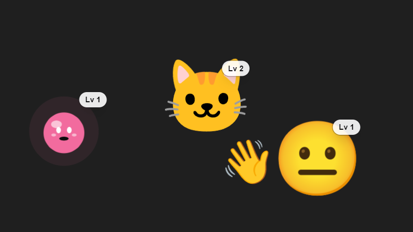

# Vibebud

English | [中文](./README.zh-CN.md)

**A little AI buddy that stays with you while you vibe code.**

Vibebud gives your coding agents a visible presence: a floating companion on your desktop, web app, or phone that can chat, show status, and tap you when something needs attention.

```text
       your code editor                 Vibebud
  +------------------------+        +-------------+
  | issue, branch, tests   |  <-->  |  floating   |
  | AI agents doing work   |        |  buddy      |
  | commits, PRs, reviews  |        |  status     |
  +------------------------+        |  chat       |
                                    +-------------+
```

Instead of letting AI agent work disappear into terminals, logs, and background processes, Vibebud makes it feel present and easy to follow.



## The Idea

Vibe coding is more fun when your tools feel alive.

Vibebud is a small companion layer for AI-assisted development. It is not trying to replace your editor, terminal, GitHub, or agent framework. It gives those workflows a friendlier face:

- See what your agents are doing at a glance
- Chat with a buddy without changing context
- Get quiet pings when a task finishes or needs input
- Assign lightweight todos to different buddy avatars
- Keep multiple agent personalities visible while you work

## How It Feels

```text
Agent starts a task      -> buddy appears active
Agent needs a decision   -> buddy sends a quiet ping
Agent finishes work      -> buddy shows a short status
You want to respond      -> open a small chat bubble
You need focus           -> dock or move the buddy away
```

The goal is simple: make AI collaborators easier to supervise without making your workspace heavier.

## What You Can Build With It

Vibebud is meant for developers experimenting with AI coding agents, desktop companions, and more playful development workflows.

| Surface | Status |
| --- | --- |
| Web preview (`core/`) | Working |
| Electron desktop - Windows | Working, NSIS installer builds end-to-end |
| Electron desktop - macOS / Linux | Planned, not yet wired up |
| Android (Capacitor 8) | Scaffolded overlay shell via `OverlayService` |
| iOS | Out of scope |
| Optional backend | Accounts, sync, backups, subscription state, and managed AI calls |

## Personalities and Groups

Each buddy has a name, a role, and its own system prompt. The six built-ins:

- **Helper** - general assistant
- **Tactician** - planner and prioritizer
- **Researcher** - digger for prior art and references
- **Skeptic** - critical reviewer who probes assumptions
- **Cheerleader** - upbeat encourager
- **Empath** - listens first, validates, then suggests

Drag two buddies near each other and they form a small team. A pastel hull appears behind them, and each member is told who its teammates are so it can defer to a better-suited specialist when appropriate.

## Quick Start

```bash
# Install deps for both core and desktop
npm run install-all

# Web preview at http://localhost:3060
npm run web-dev
```

For the desktop app:

```bash
# Run Electron pointed at the web dev server
# Use this alongside npm run web-dev in another terminal
npm run desktop-dev
```

Optional backend:

```bash
# Runs at http://localhost:3070
npm run server-dev
```

Build commands:

```bash
# Build core, copy into desktop, launch Electron against the static export
npm run desktop-run

# Windows installer -> desktop/dist/vibebud-desktop-setup.exe
npm run desktop-build

# Android debug APK on a connected device/emulator
npm run android-dev

# Android release APK
npm run android-build
```

The dev server runs on **port 3060**, not 3000. The desktop window loads the `/buddy` route, which has a transparent background so only the avatar shows through.

## Repo Layout

```text
vibebud/
├── core/        # shared Next.js UI: web app and bundled desktop UI
├── desktop/     # Electron wrapper around core/
└── mobile/      # Capacitor wrapper around core/
```

Anything that can live in `core/` should. The platform shells stay thin.

The optional backend lives at `../server/` from this package.

## Stack

- **`core/`** - Next.js 16 App Router, React 19, Tailwind v4, TypeScript 5, lottie-react. Configured for static export so the desktop shell can serve it from disk.
- **`desktop/`** - Electron 33 and electron-builder. Transparent always-on-top window covering the full work area, with click-through enabled by default and toggled off per element while the cursor is over a buddy or chat bubble.
- **`mobile/`** - Capacitor 8 plus a native overlay module that can run the buddy as a `WindowManager` overlay from a foreground service on Android.
- **`../server/`** - optional dependency-free Node.js backend for login, sync snapshots, backups, subscription state, and managed AI proxy calls.

## Bring Your Own LLM

Chat features can call OpenAI, Anthropic, or OpenRouter directly from the renderer. You enter your API key in the buddy settings panel; it is stored in `localStorage` and never leaves the device except when talking to the provider you chose.

For a hosted product model, `../server/` adds optional accounts, sync, backups, subscription state, and managed AI calls through server-owned provider keys. See [`../server/README.md`](../server/README.md).

## Why Open Source?

AI coding agents are becoming part of everyday development, but the interface around them is still early. Vibebud is an experiment in making agent work:

- more visible
- more approachable
- easier to supervise
- a little more personal

Contributions are welcome around UI polish, agent integrations, buddy behaviors, desktop/mobile shells, accessibility, docs, and product ideas.

## Star History

[](https://www.star-history.com/#shellishack/vibebud&Date)

## Name

The app is called **Vibebud**: your buddy during vibe coding.
